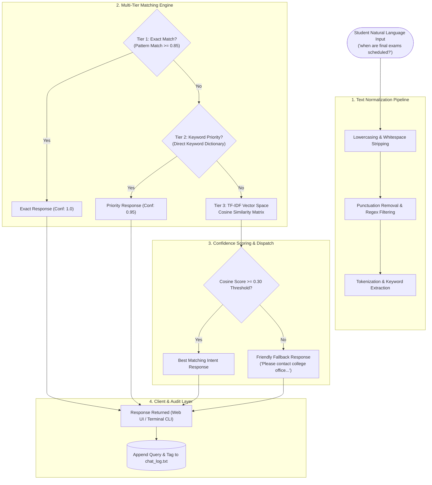

<div align="center">

<!-- Animated Header Wave Banner -->


<!-- Animated Typing Subtitle -->


<br>

<p align="center">
  
  
  
  
  
</p>

<!-- Real-Time Metrics & Indicators -->
<p align="center">
  
  
  
  
</p>

<p align="center">
  <b>A responsive Natural Language Processing (NLP) chatbot designed to streamline student access to university information, eliminating repetitive administrative queries across examinations, fees, mess menus, hostel rules, and academics.</b>
</p>

</div>

---

### 💬 Live Student Query & Response Simulation

<div align="center">

<!-- Animated Interactive Chat Simulation Terminal -->


</div>

---

## 📑 Table of Contents

- [Overview](#-overview)
- [System Architecture](#-system-architecture)
- [Core Features](#-core-features)
- [NLP & Matching Engine](#-nlp--matching-engine)
- [Knowledge Base & Intent Domains](#-knowledge-base--intent-domains)
- [REST API Specifications](#-rest-api-specifications)
- [Project Structure](#-project-structure)
- [Getting Started](#-getting-started)
- [Author & Connect](#-author--connect)

---

## 💡 Overview

University administrative desks and department heads receive hundreds of repetitive student queries every day regarding examination timetables, fee due dates, hostel allocation, library borrowing limits, and daily cafeteria menus. 

**College Student AI Chatbot** automates this communication pipeline with an intelligent, rule-backed hybrid Natural Language Processing engine:
- **Sub-15ms Latency:** Instant response delivery without requiring heavy, expensive cloud LLM APIs.
- **3-Tier Matching Hierarchy:** Guarantees exact matches for critical campus keywords while using statistical TF-IDF cosine similarity for variations in natural phrasing.
- **Dual Mode Deployment:** Functions as both an interactive web application (Flask + responsive UI) and a standalone terminal CLI.
- **Interaction Auditing:** Automatically records conversational history and unmatched queries to `chat_log.txt` for continuous intent expansion.

---

## 🏛 System Architecture

The chatbot utilizes a multi-tiered pipeline that progressively matches user queries from strict pattern matching down to vector space cosine similarities:



---

## ✨ Core Features

| Feature | Description |
| :--- | :--- |
| ⚡ **Instant Query Resolution** | Delivers accurate academic information in under 15ms using optimized local scikit-learn vectorizers. |
| 🎯 **Hybrid NLP Strategy** | Seamless combination of pattern matching, keyword dictionaries, and TF-IDF cosine similarity. |
| 🍽️ **Daily Mess & Canteen Feeds** | Provides meal breakdowns (Breakfast, Lunch, Dinner) and monthly mess subscription rates. |
| 📅 **Exam & Academic Timetables** | Instant lookups for semester exam dates, hall ticket downloads, and result portals. |
| 💰 **Fee & Accounts Navigation** | Breakdown of tuition, hostel, semester dues, and physical accounts office locations. |
| 📚 **Library & Facility Guidelines** | Timings (8 AM – 8 PM), borrowing limits (3 books for 14 days), and digital catalog instructions. |
| 🌐 **Modern Web Interface** | Clean, responsive Flask-powered chat UI with auto-scrolling conversation bubbles. |
| 🖥️ **Terminal CLI Mode** | Standalone console mode with ANSI colored prompts and ASCII branding banner. |
| 📝 **Audit Logging** | Automatically logs every question, intent tag, and timestamp to `chat_log.txt` for administrative review. |

---

## 🧠 NLP & Matching Engine

The decision logic operates across three progressive tiers to balance speed and semantic flexibility:

```python
# Tier 1: Exact Pattern Matching
user_words = set(preprocess(user_input).split())
# Evaluates intersection with verified intent patterns

# Tier 2: Priority Keyword Lookup
priority_responses = {
    "mess": "🍽️ Mess Menu Today: Breakfast, Lunch, Dinner...",
    "fee":  "💰 Annual tuition: ₹45,000 | Semester: ₹22,500...",
    "exam": "📅 End Semester Exams: Check student portal..."
}

# Tier 3: TF-IDF Vectorization & Cosine Similarity
vectorizer = TfidfVectorizer()
tfidf_matrix = vectorizer.fit_transform(corpus)
similarity_scores = cosine_similarity(user_vector, tfidf_matrix)
```

- **Confidence Threshold:** `0.30` (Filters out unrelated noise or gibberish).
- **Exact Threshold:** `0.85` (Bypasses matrix computation for instantaneous response).

---

## 📚 Knowledge Base & Intent Domains

The bot's unified dataset (`dataset.json`) encompasses **70+ unique campus intents**:

- 🎓 **Academics:** Course syllabus, department contacts, faculty offices, academic calendar.
- 📝 **Examinations:** Schedule, admit card / hall ticket download, revaluation process.
- 💳 **Fees & Finance:** Tuition fees, lab charges, payment deadlines, scholarship procedures.
- 🏠 **Campus Accommodation:** Boys & girls hostel allotment, room rules, warden contacts.
- 🍽️ **Dining:** Daily breakfast, lunch, and dinner menus; monthly mess passes.
- 📖 **Library:** Timings, fine policies, book renewal, research journals access.
- 🚀 **Placements:** Training & placement cell contacts, recruiting companies, mock interviews.

---

## 📡 REST API Specifications

The Flask application exposes a lightweight JSON endpoint for seamless frontend and mobile integration:

### Query Bot
- **Endpoint:** `POST /get_response`
- **Headers:** `Content-Type: application/json`
- **Request Body:**
```json
{
  "message": "When do end semester exams start?"
}
```
- **Response (`200 OK`):**
```json
{
  "response": "📅 End Semester Exams begin on 10th Dec 2024. Please check the student portal for detailed subject timetables.",
  "tag": "exam",
  "confidence": 0.95
}
```

---

## 📂 Project Structure

```
college-student-ai-chatbot/
├── chatbot.py            # Main application runner (Flask Web + CLI Engine)
├── dataset.json          # Unified intent dataset with 70+ campus categories
├── update_dataset.py     # Utility script for appending & normalizing intents
├── chat_log.txt          # Conversation audit and analytics log
├── requirements.txt      # Python dependencies (scikit-learn, numpy, flask)
├── static/               # Frontend assets (CSS stylesheets, icons)
│   └── style.css         # Modern chat bubble UI styling
├── templates/            # Jinja2 HTML templates
│   └── index.html        # Interactive student chat web portal
└── model/                # Serialized model cache & preprocessed components
```

---

## 🚀 Getting Started

### Prerequisites
- Python `3.9` or higher
- `pip` package manager

### 1. Clone & Set Up Environment

```bash
# Clone the repository
git clone https://github.com/anish03-hub/college-student-ai-chatbot.git
cd college-student-ai-chatbot

# Create and activate virtual environment
python3 -m venv venv
source venv/bin/activate    # On Windows: venv\Scripts\activate

# Install dependencies
pip install -r requirements.txt
```

### 2. Launch Web Interface

```bash
python chatbot.py
```
Open your browser and navigate to **`http://localhost:5000`** to chat with CollegeBot.

### 3. Launch in Terminal CLI Mode

Run without web server dependencies:
```bash
python chatbot.py --cli
```

---

<div align="center">

## 👨‍💻 Author & Connect

**Anish Kumar Sah**  
*Java Developer | Spring Boot & REST APIs | B.Tech CSE @ Symbiosis Institute of Technology, Pune*

[](https://www.linkedin.com/in/anishsah)
[](mailto:sah42515@gmail.com)
[](https://github.com/anish03-hub)

<br>

<!-- Animated Waving Footer Banner -->


<sub>Built with ❤️ using Python, scikit-learn, and Flask. Empowering students with instant campus knowledge.</sub>

</div>
